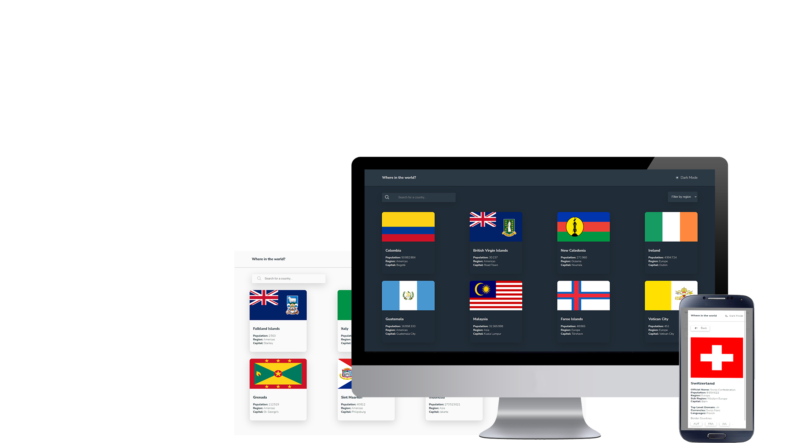

# REST Countries API with color theme switcher

## What is this page about?

REST Countries API is a project proposed by Frontend Mentor. 
It is about integrating as well as possible a design proposed as a challenge.
The starting sources are images (jpg) and that's it.

You can look at a final preview here at [Bookmark - Landing page](https://loaw.github.io/bookmark-landing-page/)

## Tech point
The technologies used for this project are the following: 
-  HTML = site structure
-  CSS / SCSS = appearance of the site
-  JavaScript = site behavior
-  REST API = collect and display data

## Learning objectives
- Interact with a REST api to collect and display data
- Search fields with autocompletion
- Country filtering by continent
- Write meaningful, semantically correct HTML
- Use modern positioning techniques using the grid or flexbox model
- Create a "pixel-perfect" integration from a given wireframe
